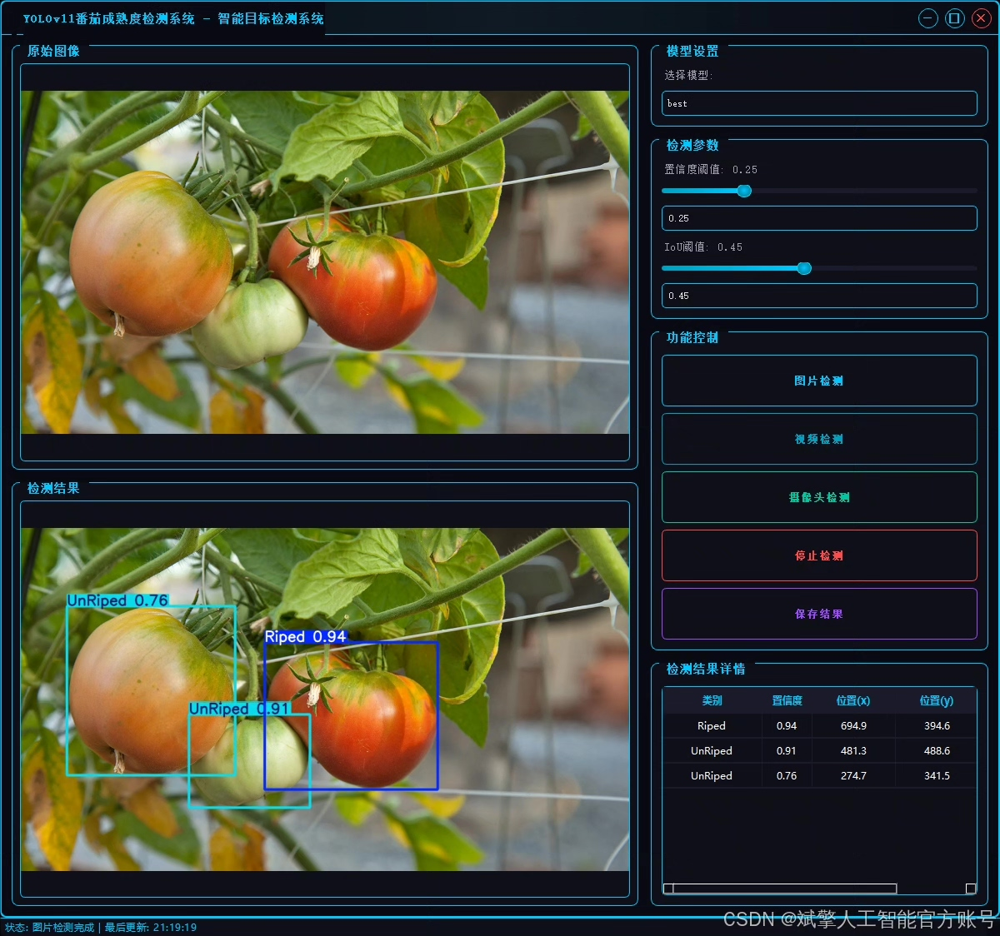
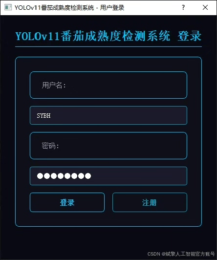
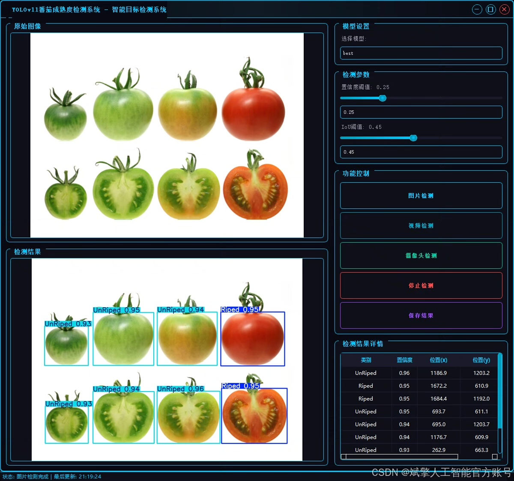
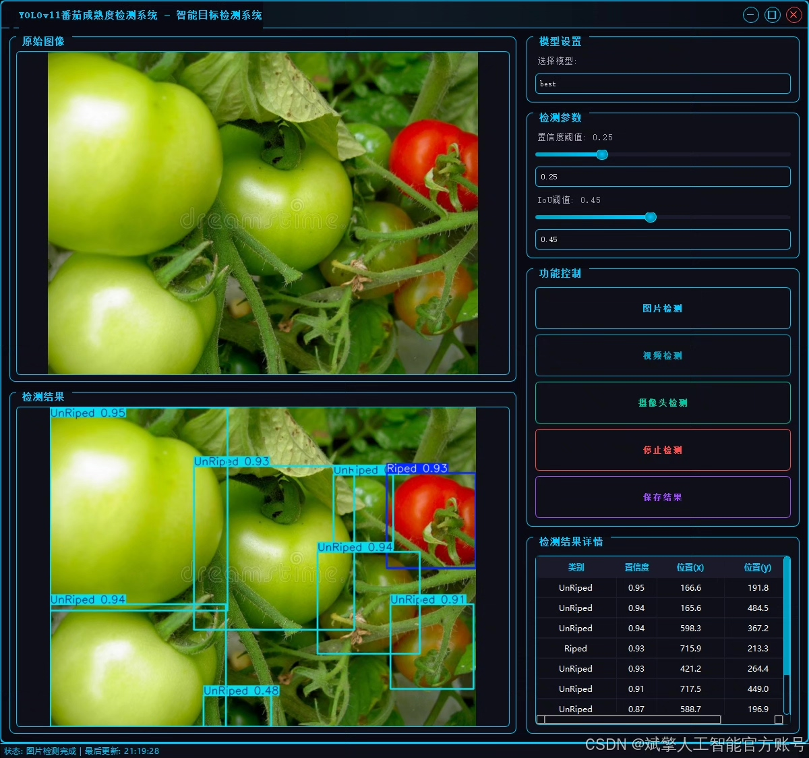
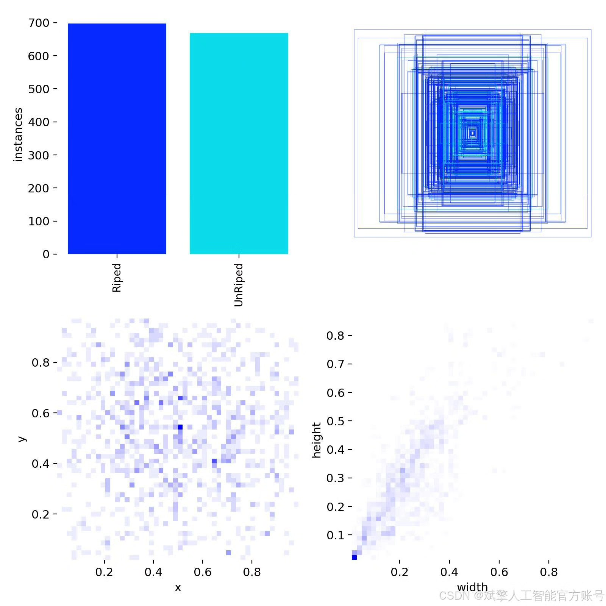
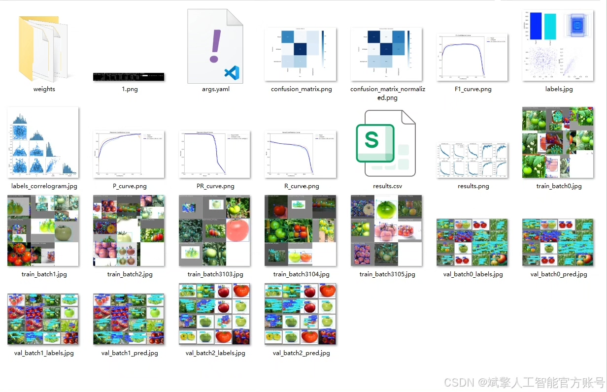
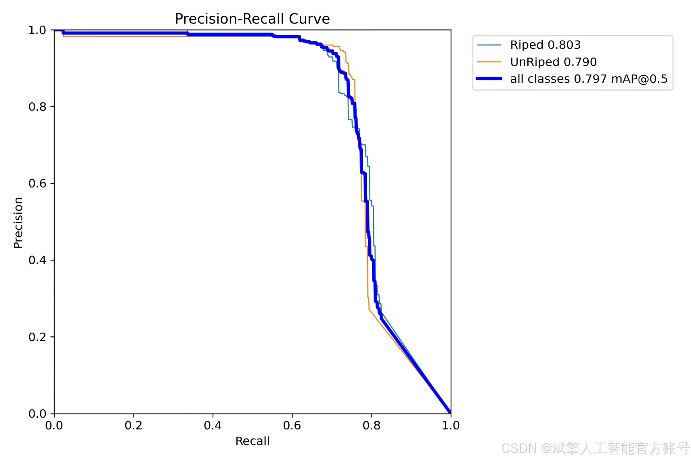
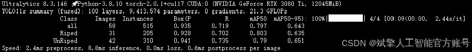
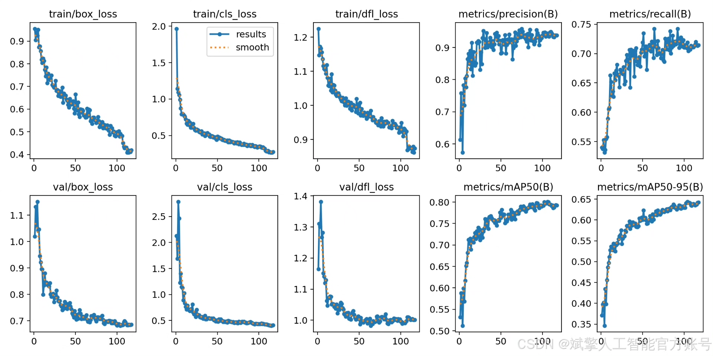

# YOLOv11 Tomato Maturity Detection System

## Body

The tomato ripeness detection system based on deep learning YOLOv11 is a tomato ripeness detection system (YOLOv11+YOLO dataset + UI interface + login registration interface + Python project source code + model).

Class 2:
Names: ['Riped', 'UnRiped']
Dataset size: Training set 230, Validation set 58.

✅ User Login and Signup: Supports password detection and security verification.

✅ Three detection modes: based on the YOLOv11 model, support image, video and real-time camera three detection, accurate recognition of targets.

✅ Dual-screen comparison: Display the original image and the detection result on the same screen.

✅ Data Visualization: Real-time table display of detection target categories, confidence and coordinates.

✅ Intelligent Parameter Tuning: Offers a confidence slide, dynamically optimizes detection accuracy to meet different scene requirements.

✅ Sci-fi style interactive interface: dark theme combined with dynamic light effects, reducing visual fatigue and improving operational experience.

## Images

## Payment

Here is a pay link on Stripe ( https://buy.stripe.com/3cs8yP7sY87d0vu9AB ). Please contact me lonlonago@foxmail.com after funding $89, and I will send you a complete data files , thank you!

